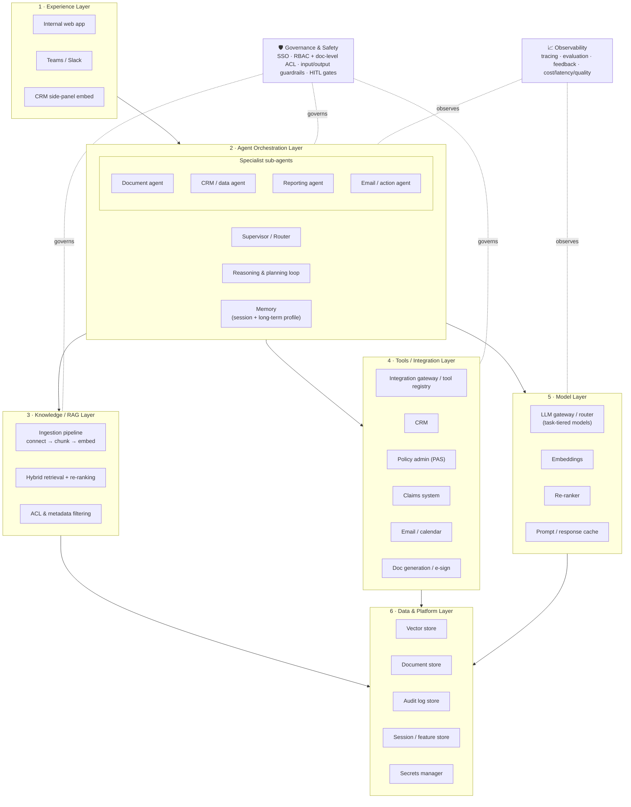
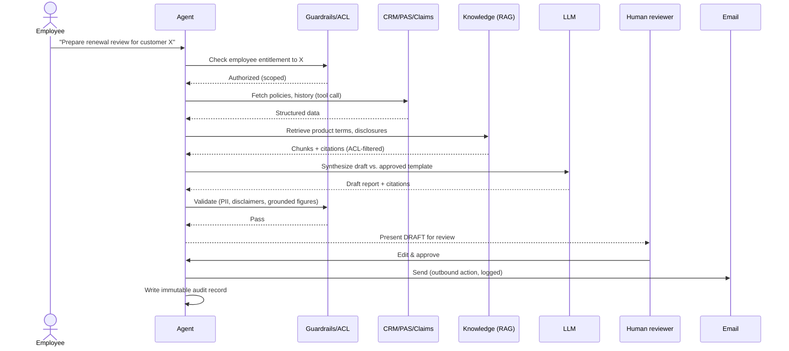
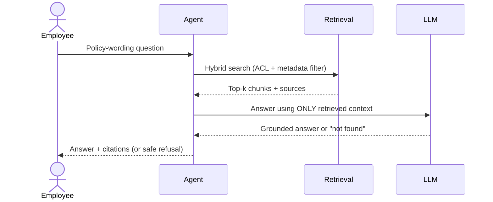
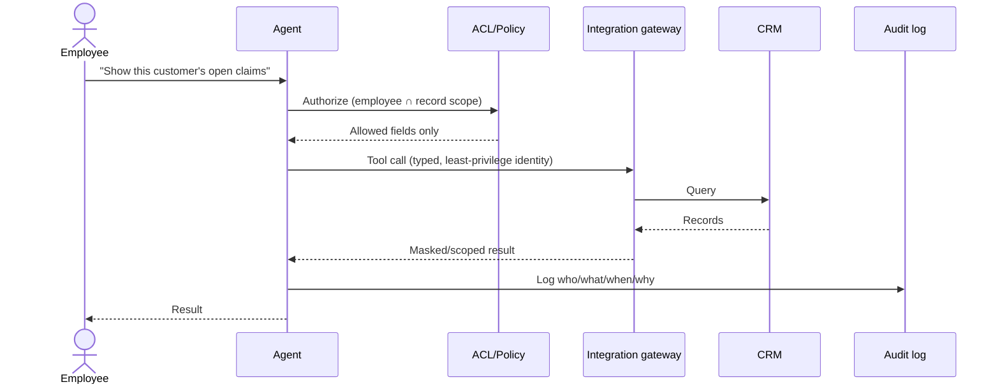
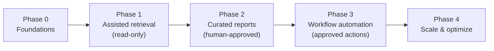

# Enterprise AI Agent for Insurance — Solution Design

**Version:** 1.0  **Date:** 2026-09-21  **Status:** Draft for review
**Audience:** Business sponsors, enterprise architects, security & compliance, delivery leads

---

## 1. Executive summary

This document proposes a reference architecture and delivery roadmap for an
**enterprise AI agent** that internal insurance employees use to work faster and
serve customers better. The agent gives staff a single conversational assistant
that can:

- **Retrieve and reason over internal documents** — policies, product guides, underwriting manuals, claims playbooks, compliance bulletins — with cited answers.
- **Generate curated, client-ready reports** — renewal reviews, coverage summaries, claims-status letters, policy statements — assembled from live data and approved by a human before it reaches a customer.
- **Pull customer data from systems of record** — CRM, policy administration (PAS), and claims — scoped to what the individual employee is entitled to see.
- **Act through connected tools** — draft and send email, schedule follow-ups, generate documents — always behind a human-approval gate for anything customer-facing.

**Design posture.** The architecture is **cloud-agnostic**: it names *capabilities*
(LLM gateway, vector store, orchestrator, guardrails) rather than specific products,
so the insurer avoids lock-in and can implement on its chosen stack. Appendix A maps
each capability to representative products, including the BytePlus services this
repository already demonstrates.

**Why it matters.** Insurance service and advisory work is document-heavy,
data-fragmented, and highly regulated. A grounded, auditable agent removes the manual
"swivel-chair" work of gathering data from many systems and drafting client
communications, while keeping a human accountable for every customer-facing output.

### Target business outcomes

| Outcome | How the agent contributes |
|---|---|
| Lower average handle time | One place to ask, retrieve, and draft — no system hopping |
| Faster report/quote turnaround | Auto-assembled curated reports from live data + documents |
| Higher first-contact resolution | Grounded answers with citations at the point of service |
| More adviser capacity | Routine drafting and lookup automated; adviser focuses on the client |
| Consistent, compliant communications | Templated, guardrailed, human-approved outputs with audit trail |
| Faster onboarding of new staff | Institutional knowledge available conversationally |

---

## 2. Personas & primary use cases

| Persona | Job to be done | Agent workflow |
|---|---|---|
| **Advisor / agent** | Prepare for a client review or renewal | Pull policies & CRM history → retrieve product/regulatory docs → draft a curated review pack → advisor edits → send |
| **Service representative** | Answer a policyholder query | Identify customer → fetch policy/claim status → ground answer in policy wording → cite → respond |
| **Underwriter** | Research risk & guidelines | Retrieve underwriting manual + prior similar cases → summarize applicable rules → draft rationale |
| **Claims handler** | Move a claim forward | Pull claim + policy → check coverage against wording → draft status letter → route for approval |
| **Ops / compliance** | Oversight & audit | Review agent audit trail: who asked, what data was accessed, what was generated/sent |

### Flagship flow — "generate a curated client report"

1. Employee asks the agent to prepare a report for a named customer.
2. Agent resolves the customer identity and **checks the employee's entitlement** to that record.
3. Agent pulls structured data (CRM relationship, policies, claims) via tools.
4. Agent retrieves relevant documents (product terms, disclosures) via RAG.
5. Agent synthesizes a **draft** report against an approved template, with citations.
6. Guardrails validate the draft (PII handling, required disclaimers, no unsupported figures).
7. **Human reviews, edits, and approves.** Nothing is sent automatically.
8. On approval, the agent generates the document and emails it (as an outbound action, logged).
9. The full interaction — inputs, data accessed, tools called, output, approver — is written to an immutable audit log.

---

## 3. Reference architecture

The system is organized as layers. Two layers — **Governance & Safety** and
**Observability** — are cross-cutting and touch every request.

### Layer responsibilities

1. **Experience layer** — where employees meet the agent: an internal web app, a
   chat surface (Teams/Slack), and an embed inside the CRM so the agent is available
   in the flow of work. Streaming responses keep the UX responsive.

2. **Agent orchestration layer** — the runtime brain:
   - **Supervisor/router** classifies intent and routes to the right capability.
   - **Reasoning/planning loop** decides which tools and knowledge to use, in what order.
   - **Memory**: short-term conversation context plus long-term per-user preferences and prior interactions (never shared across users).
   - **Specialist sub-agents** for documents, CRM/data, reporting, and email/actions.
   > **Start single-agent.** Use one capable agent with well-designed tools first;
   > introduce multi-agent decomposition only when a workflow is genuinely separable
   > and the added coordination cost is justified.

3. **Knowledge / RAG layer** — turns the document corpus into grounded answers:
   ingestion (connectors → chunking → embeddings), **hybrid retrieval** (dense +
   keyword) with **re-ranking**, and **ACL/metadata-aware filtering** so retrieval
   only ever returns documents the employee is allowed to see. Every answer carries
   **citations** back to source.

4. **Tools / integration layer** — typed, allow-listed tool interfaces to CRM, PAS,
   claims, email/calendar, and document generation/e-signature, fronted by an
   **integration gateway / tool registry** with per-tool authentication, idempotency,
   and error handling. A standard tool protocol (e.g., MCP / agent-to-agent) keeps
   integrations reusable across use cases.

5. **Model layer** — an **LLM gateway/router** that selects the right model per task
   (a cheap fast model for routing/extraction; a stronger model for synthesis),
   plus embeddings, an optional re-ranker, and prompt/response **caching**. The
   gateway is the abstraction that delivers cloud-agnosticism and cost control.

6. **Data & platform layer** — vector store, document store, **immutable audit log**,
   session/feature store, and a secrets manager. Data residency and tenancy are set here.

7. **Governance & safety (cross-cutting)** — identity/SSO, RBAC + document-level ACLs,
   input/output guardrails, and human-in-the-loop approval gates. See §5.

8. **Observability (cross-cutting)** — tracing, evaluation, feedback capture, and
   cost/latency/quality dashboards. See §5.

---

## 4. Key data flows

### 4.1 Flagship — curated report generation (with human approval)

### 4.2 Document Q&A / RAG with citations

### 4.3 CRM data pull with ACL enforcement & audit

---

## 5. Enterprise best-practices deep-dive

These are the properties that make the agent safe for a regulated insurer — they are
built in, not bolted on.

### 5.1 Security
- **SSO / OIDC** for employee identity; no standalone credentials.
- **Per-user data scoping (critical):** the agent acts with the *employee's* entitlements — never a superuser service account that can see all customers. Retrieval and tool calls are filtered by the caller's identity.
- **Least-privilege service identities** for each backend integration; short-lived tokens from a **secrets manager**.
- **Network isolation** (private endpoints/VPC), encryption in transit and at rest, and defined **data residency/tenancy**.

### 5.2 Data governance & privacy
- **PII/PHI minimization & masking/redaction** before content reaches the model.
- Contractual/technical guarantee of **no training on customer data**.
- **Retention and right-to-erasure** honored across vector store, caches, and logs.
- **Document-level access control** propagated into retrieval (ACLs indexed as metadata).

### 5.3 Prompt-injection & tool-abuse defense
- Treat **retrieved documents, CRM records, and email content as untrusted input** — they may contain instructions; the agent must not obey them.
- **Allow-listed tools** only; **confirmation gates** for state-changing or outbound actions.
- **Output validation** against schemas; block/redact unexpected content.

### 5.4 Human-in-the-loop (HITL)
- **Mandatory approval gates** for anything customer-facing (emails, letters, advice) and any high-risk action.
- Clear **"draft vs. sent"** states; one-click edit/override; required disclaimers on client outputs.
- The human remains **accountable** for the final output — the agent assists, it does not decide.

### 5.5 Accuracy & grounding
- **RAG with citations**; the agent answers from retrieved context, not memory.
- Explicit **"I don't know" / safe-refusal** behavior; **out-of-scope refusal** for regulated financial advice it isn't authorized to give.
- Hallucination controls: **no unsupported figures** in reports; numbers must trace to a source system.

### 5.6 Evaluation & quality
- **Golden-set / regression evals** run pre-production and on every prompt/model change.
- **LLM-as-judge** plus **groundedness/citation checks** and task-success metrics.
- **Red-teaming** for prompt injection, data exfiltration, and jailbreaks.
- **Continuous evaluation** on sampled production traces; quality gates before promoting changes.

### 5.7 Observability & auditability
- **End-to-end tracing** of every request: prompt, retrieved context, tool calls, model, output.
- **Immutable audit trail** — who asked, what data was accessed, what was generated/sent, who approved — sufficient for **regulatory examination**.
- Dashboards for quality, adoption, cost, and latency.

### 5.8 Reliability, cost & latency
- **Model routing/tiering** and **caching** to control cost.
- **Timeouts, retries, fallback models**, and rate limits for resilience.
- **Streaming UX** so perceived latency stays low.
- **Budget guardrails** and per-team cost attribution.

### 5.9 Responsible AI & compliance
- Alignment to relevant regimes: **data protection (e.g., GDPR)**, **insurance conduct rules**, **model-risk-management** (SR 11-7-style governance), and **EU AI Act** risk classification/documentation.
- **Bias monitoring**, **model cards**, and documented **human accountability** for outcomes.

---

## 6. Integration patterns

- **Typed tools:** each tool has a strict input/output schema, is **idempotent** where it mutates state, and returns structured errors the agent can reason about.
- **Tool registry / gateway:** central place to register, version, authenticate, rate-limit, and audit tools. Adopt a **standard tool protocol (MCP / agent-to-agent)** so a tool built once is reusable across use cases and agents.
- **Connectors:** read paths to CRM/PAS/claims first (low risk); write paths (send email, update case) added later behind approval gates.
- **Events vs. request/response:** synchronous for interactive Q&A; asynchronous/eventing for long-running report jobs and batch ingestion.
- **Ingestion:** scheduled + event-driven re-indexing; capture source ACLs and metadata (line of business, jurisdiction, effective date) for filtering and freshness.

---

## 7. Delivery roadmap (phased)

Deliver value early and expand autonomy only as guardrails and evaluation earn trust.

| Phase | Scope | Entry / advance criteria |
|---|---|---|
| **0 · Foundations** | Identity/SSO, LLM gateway, guardrails, observability, eval harness, one read-only knowledge base | Security review passed; eval harness live; audit logging on |
| **1 · Assisted retrieval (read-only)** | Document Q&A + CRM read tools, citations, **no outbound actions** | Groundedness/citation eval ≥ bar; ACL filtering verified; positive pilot feedback |
| **2 · Curated report generation** | Synthesis + doc generation with **mandatory review gate**; email **drafts only** | Report quality eval ≥ bar; HITL workflow adopted; no unsupported-figure escapes in red-team |
| **3 · Workflow automation** | Approved outbound actions (send email, schedule); multi-agent specialization; guarded PAS/claims writes | Action guardrails + audit proven; rollback tested; compliance sign-off |
| **4 · Scale & optimize** | More use cases; cost/latency tuning; measured autonomy expansion | Cost/quality/latency within targets; continuous-eval stable |

Each phase requires its guardrail and evaluation bar to be met before advancing.

---

## 8. Risks & mitigations

| Risk | Mitigation |
|---|---|
| Hallucinated financial figures in client outputs | Grounded RAG + "figures must trace to a source system" rule + HITL approval |
| Customer data leakage / cross-account access | Per-user entitlement scoping; document-level ACLs; masking; audit |
| Prompt injection via documents/CRM/email | Untrusted-input handling; allow-listed tools; output validation; confirmation gates |
| Over-automation of regulated advice | Out-of-scope refusal; mandatory human approval; conduct-rule alignment |
| Model drift / quality regression | Continuous evaluation; regression gates on every change |
| Vendor lock-in | Cloud-agnostic gateway abstractions (Appendix A) |
| Low adoption | In-CRM embedding, streaming UX, change management, visible time savings |

---

## Appendix A — Cloud-agnostic capability → product mapping

The body of this design is vendor-neutral. This table shows representative options,
including the **BytePlus** services demonstrated in this repository, so the design is
directly actionable here without being locked to any one stack.

| Capability | Neutral description | Representative options (incl. BytePlus in this repo) |
|---|---|---|
| **LLM gateway/router** | Task-tiered model access, OpenAI-compatible | BytePlus **ModelArk** (`byteplussdkarkruntime`, endpoint IDs) · other managed LLM APIs |
| **Embeddings** | Vectorize documents & queries | ModelArk / managed embedding models (e.g., `bge-large-zh-and-m3`) |
| **Vector store** | Similarity + hybrid search | BytePlus **VikingDB** (`search_with_multi_modal`, hybrid dense/sparse) |
| **Managed RAG / knowledge base** | Ingestion + retrieval as a service | BytePlus managed **Knowledge Base** (`hnsw_hybrid`, image OCR preprocessing) |
| **Agent/workflow orchestration** | Hosted planner + tool-calling | BytePlus **HiAgent** (`run_app_workflow`) · self-hosted (LangGraph/CrewAI) |
| **Multi-agent interop** | Agent discovery & task lifecycle | **A2A** protocol (agent cards, task states, SSE streaming) |
| **Object storage** | Documents & generated assets | BytePlus **TOS** · equivalent object storage |
| **Tool integration** | CRM/order/customer tools | Generalize the repo's `customerID`/`getorder`/`CustomerDetails` agents into CRM/email/doc tools |
| **Guardrails, observability, eval** | Safety + quality (gap to add) | Not present in demos — add dedicated guardrail, tracing, and eval components |

Reference patterns in this repo: `README.md`, `ModelArkAPIs/chatCompletion.py`,
`KnowledgeBase_Demo/CreateKnowledgeBase.py`,
`VectorDB_Demos/newsAiChat/news_chatbot.py`, `HiAgent/ProcessAgentDemo/app.py`,
`A2A/A2A/README.md`, `A2A/A2A/samples/python/agents/langgraph/`.

---

## Appendix B — Glossary

| Term | Meaning |
|---|---|
| **RAG** | Retrieval-Augmented Generation — grounding answers in retrieved documents |
| **HITL** | Human-in-the-loop — a person reviews/approves before an action takes effect |
| **ACL** | Access Control List — who may see a given document/record |
| **PAS** | Policy Administration System |
| **PII / PHI** | Personally Identifiable / Protected Health Information |
| **MRM** | Model Risk Management (e.g., SR 11-7-style governance) |
| **Guardrail** | Automated input/output check enforcing safety & policy |
| **MCP / A2A** | Standard protocols for tool integration and agent-to-agent interop |
| **Groundedness** | Degree to which an answer is supported by cited sources |
